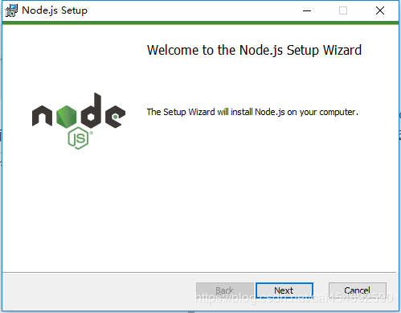
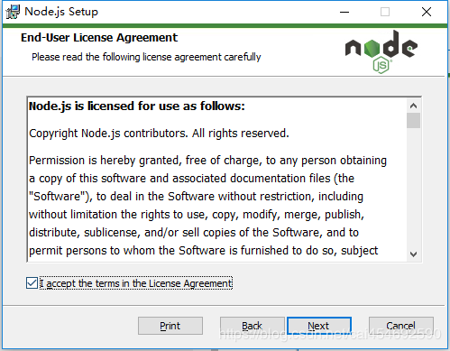
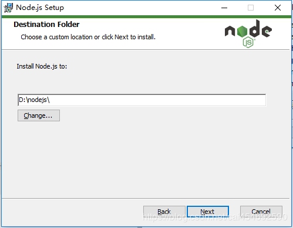
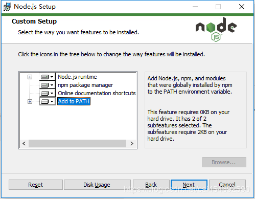
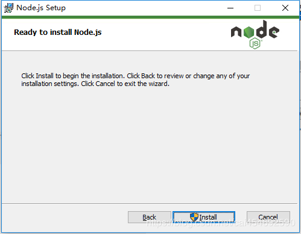
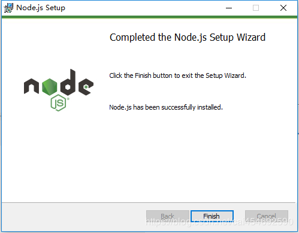
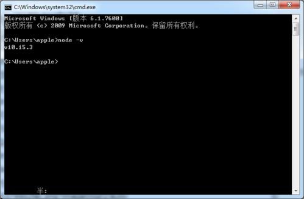
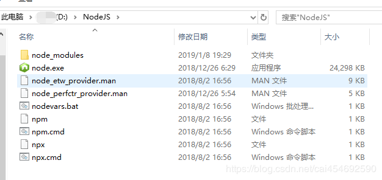

# JCUMap

## NodeJS (Prefer LTS Version, Testing Environment: v12.3.1)

### Windows
1. Download package from [https://nodejs.org/en/download/](https://nodejs.org/en/download/). 

2. Install, keep default
<div style="color:#0000FF" align="center">
 
</div>
<div style="color:#0000FF" align="center">
 
</div>
<div style="color:#0000FF" align="center">
 
</div>
<div style="color:#0000FF" align="center">
 
</div>
<div style="color:#0000FF" align="center">
 
</div>
<div style="color:#0000FF" align="center">
 
</div>

3. To check which version of Node.js you have installed after these initial steps, type: *node -v*. Open the directory of installed *node*.
<div style="color:#0000FF" align="center">
 
</div>
<div style="color:#0000FF" align="center">
 
</div>

### Linux
1. We can use the *apt* package manager
```
sudo apt update
```

2. Install Node.js from the repositories:
```
sudo apt-get install nodejs
```

3. Install npm:
```
sudo apt-get install npm
```

4. To check which version of Node.js you have installed after these initial steps, type:
```
node -v
```

### Mac
1. We can use Homebrew
```
brew install node
```

2. To check which version of Node.js you have installed after these initial steps, type:
```
node -v
```

## Usage of JCUMap
1. Download the repository of JCUMap from [Github](https://github.com/sidongfeng/JCUMap)
```
git clone https://github.com/sidongfeng/JCUMap
cd JCUMap
```

2. Install all the python dependencies using pip:
```
pip install -r requirements.txt
```

3. Run server. Website will be available at http://localhost:8000/
```
node server.js
```

## Resources
1. Development of a competency mapping tool for undergraduate professional degree programmes, using mechanical engineering as a case study [pdf](https://github.com/sidongfeng/JCUMap/blob/master/resources/Holmes%2Bet%2Bal%2B2018%2BEuropean%2BJournal%2Bof%2BEngineering%2BEducation.pdf)

2. Example Course xml [COMP4130.xml](https://github.com/sidongfeng/JCUMap/blob/master/resources/COMP4130.xml) and Mapping xml [COMP4130MappingResult.xml](https://github.com/sidongfeng/JCUMap/blob/master/resources/COMP4130MappingResult.xml)

3. TODO: Tutorial Video 